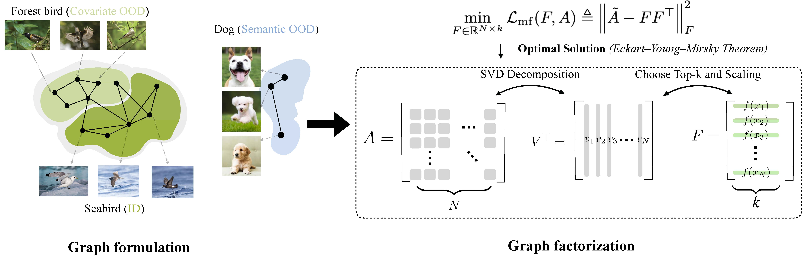

# Bridging OOD Generalization and Detection: A Graph-Theoretic View

This is the source code accompanying the NeurIPS 2024 paper of [Bridging OOD Generalization and Detection: A Graph-Theoretic View](https://arxiv.org/abs/2409.18205)  by Han Wang, Yixuan Li.



## Environment Preparation
You can set up the environment by running the following commands:
```bash
conda create --name graph_ood python==3.9.17
conda activate graph_ood
pip install -r requirements.txt
```

## Dataset Preparation
Download the dataset to the folder `./data`

Here are the links for the semantic OOD datasets used in this paper: [SVHN](http://ufldl.stanford.edu/housenumbers/), [Textures](https://www.robots.ox.ac.uk/~vgg/data/dtd/), [Places365](http://places2.csail.mit.edu/download.html), [LSUN](https://www.dropbox.com/s/fhtsw1m3qxlwj6h/LSUN.tar.gz), [LSUN-R](https://www.dropbox.com/s/moqh2wh8696c3yl/LSUN_resize.tar.gz), and [iSUN](https://www.dropbox.com/s/ssz7qxfqae0cca5/iSUN.tar.gz). We refer readers to these links [Scone](https://github.com/deeplearning-wisc/scone) and [Robustness](https://github.com/hendrycks/robustness) to download the covariate OOD datasets.

For large-scale experiments, we use iNaturalist as the semantic OOD dataset. The dataset can be downloaded via the following link:
```bash
wget http://pages.cs.wisc.edu/~huangrui/imagenet_ood_dataset/iNaturalist.tar.gz
```

## Demo
To pretrain the model (e.g., using the CIFAR-10-C as the covariate OOD dataset and SVHN as the semantic OOD dataset), you can modify the variable `checkpoints_dir` in the `./CIFAR/run_pt.sh`, and run the following command:
```bash
sh run_pt.sh graph_ood cifar10 svhn svhn
```
pi_1 is set to 0.5 and pi_2 is set to 0.1 as default. See the `run_pt.sh` for more details and options.

To finetune the model, you can modify the variable `load_pretrained` in the `./CIFAR/run_ft.sh` and run the following command:
```bash
sh run_ft.sh graph_ood cifar10 svhn svhn
```

## Checkpoints
We also provide some checkpoints during the pretraining process, please see `./CIFAR/snapshots`.

## Citations

If you find our work useful, please consider citing our paper:

```
@article{wang2024bridging,
  title={Bridging OOD Detection and Generalization: A Graph-Theoretic View},
  author={Wang, Han and Li, Yixuan},
  journal={Advances in Neural Information Processing Systems},
  year={2024}
}
```

Our codebase is heavily based on the followings:

```
@inproceedings{
    sun2023sorl,
    title={A Graph-Theoretic Framework for Understanding Open-World Semi-Supervised Learning},
    author={Yiyou Sun and Zhenmei Shi and Yixuan Li},
    booktitle={Advances in Neural Information Processing Systems},
    year={2023},
    url={https://openreview.net/forum?id=ZITOHWeAy7}
}
```
```
@inproceedings{bai2023feed,
      title={Feed Two Birds with One Scone: Exploiting Wild Data for Both Out-of-Distribution Generalization and Detection}, 
      author={Haoyue Bai and Gregory Canal and Xuefeng Du and Jeongyeol Kwon and Robert D Nowak and Yixuan Li},
      booktitle = {International Conference on Machine Learning},
      year = {2023}
}
```
```
@inproceedings{katz2022training,
  title={Training Ood Detectors in Their Natural Habitats},
  author={Katz-Samuels, Julian and Nakhleh, Julia B and Nowak, Robert and Li, Yixuan},
  booktitle={International Conference on Machine Learning},
  year={2022}
}
```
